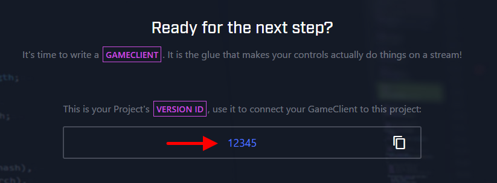

# MetaButtons v0.1.3 [](https://nodejs.org/) [](https://beam.pro/)

A handy keyboard for [&nbsp;Beam&nbsp;interactive&nbsp;2](https://dev.beam.pro/reference/interactive/).  
This makes use of [beam-interactive-node2](https://github.com/WatchBeam/beam-interactive-node2).

## What it does
This script lets you set up a keyboard for your [Beam](https://beam.pro/) channel by defining a simple set of controls.
When viewers press your buttons, keys that are defined in corresponding files will get pressed and control your content.

This is especially useful for interactive streams.

See it in action on [YouPlay](https://beam.pro/Youplay)!

## Installation
### Prerequisites
1.	Enter the [&nbsp;*Interactive&nbsp;studio*](https://beam.pro/i/studio).
1.	Create a new Project.
1.	Give it a name and optionally fill out other fields.
1.	Skip the *Build* section.
1.	At *Code* grab your **version ID**. You will need that later on.
	
		
### Setting up
1.
	Fetch node packages  
	```shell
	npm i
	```
1.
	Rename the example config directory  
	```shell
	mv config_example config
	```
1.
	Edit *auth.json* and replace the dummy value with [your OAuth token](https://dev.beam.pro/reference/oauth/).  
	You will need following OAuth scope:
	-	``interactive:robot:self``
1.
	Build the code.
	```shell
	npm run build
	```
1.
	Do a test run!
	```shell
	node index.js "./config/controls/NES/layout.json" "./config/controls/NES/mapping.json" 
	```
	(or use ``start.sh`` or ``start.bat`` as an example)
1.
	Configure layouts and mappings as you wish.

## How things work
### Running it
Program arguments are as follows
-	*path to layout [JSON](https://www.w3schools.com/js/js_json_intro.asp) file.*
-	*path to mapping [JSON](https://www.w3schools.com/js/js_json_intro.asp) file.*
-	*version ID.* (see above)

### Layout files
The layout files consist of a [JSON](https://www.w3schools.com/js/js_json_intro.asp) object that holds following information:
-	~~**extends** (String)  
	This holds the path for a layout file this layout configuration should extend from.~~  
	**Available soon**.
	
-	**layout** (Object)  
	This holds the available scenes (only *default* is used right now) as key-value.  
	The name of the scene is the key.
		-	**&lt;sceneName&gt;** (Array)  
			(for example: '*default*')  
			This holds the configuration of the buttons in [JSON](https://www.w3schools.com/js/js_json_intro.asp) format.  
			You can design the layout and copy the [JSON](https://www.w3schools.com/js/js_json_intro.asp) configuration in the &nbsp;[*Interactive studio*](https://beam.pro/i/studio).	

### Mapping files
The mapping files consist of a [JSON](https://www.w3schools.com/js/js_json_intro.asp) object that holds following information:
-	**&lt;control identifier&gt;** (String)   
	(for example: ``"A_button": "a"``)  
	This defines what button is pressed when the interactive control is used.	

## Contributing
After editing the `.ts` source files in ``src``, run  
``npm run build``  
(Compiles the [TypeScript](https://www.typescriptlang.org/) code to [NodeJS](https://nodejs.org/) code)

## Todo
-	**Ban list**  
	So that you can keep people from going wild on your buttons
-	**Moderator / team / role lists** (may become the same system as ban lists)  
	So that you can allow certain people to press certain buttons.	
-	**Layout extending**  
	So that for example the *SNES* layout can inherit the *NES* layout and just add L and R  
	(Halfway done, just needs proper backend logic)
-	**Actual support of multiple scenes**  
	Right now this only serves a default scene which is filled with generated buttons out of the config files.
-	**Visual feedback in the console**  
	Some gauges or graphs, so that you can see what happens.  
	Right now it's just some prefixes of messages.
-	**Visual feedback on buttons, cooldowns and keyboard interaction**  
	It looks like this isn't quite working with ``beam-interactive-node2`` yet.  
	I'll work on it as soon as it's supported.
-	**Configuration of button actions**  
	So that you can also let buttons switch scenes for a user, have them update other buttons or scenes or let them do other stuff than just pressing a button.  
	This could involve interaction with some kind of [Socket](https://en.wikipedia.org/wiki/Network_socket) or starting a program.  
	(The problems of the above list item apply here)
-	**Joystick support**
